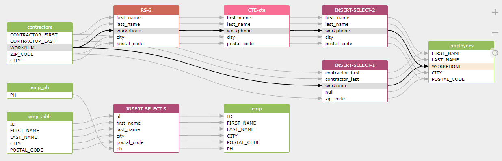

## SQLFlow Introduce

The SQLFlow is a tool helps you collect data lineage information by analying the SQL scripts
in a governed data environment. It scans SQL code to understand all the logic and reverse engineer it, 
to build an understanding of how data changes and which data serves as input for calculating other data. 

Once the metadata of the data lineage is ready, SQLFlow presents a nice clean graph to you that tells
where the data came from, what transformations it underwent along the way, 
and what other data items are derived from this data value.

### What SQLFlow can do for you
- Provide a nice cleam diagram to the end-user to understand the data lineage quickly.
- Incorporate the lineage metadata decoded from the complex SQL script into your own metadata database for further processing.
- Visualize the metadata already existing in your database to release the power of data.
- Perform impact analysis and root-cause analysis by tracing lineage backwards or forwards with several mouse click.
- Able to process SQL script from more than 20 major database vendors.

### How to use SQLFlow
- Open [the official website](https://gudusoft.com/sqlflow/#/) of the SQLFlow and paste your SQL script or metadata to get a nice clean lineage diagram.
- Call the Restful API of the SQLFlow in your own code to get data lineage metadata decoded by the SQLFlow from the SQL script.
- The on-premise version of SQLflow enables you to use it on your own server to keep the data safer.

### The price plan
- [SQLFlow price plan](https://gudusoft.com)

### Restful APIs
- [SQLFlow API document](https://github.com/sqlparser/sqlflow_public/blob/master/api/sqlflow_api.md)
- [Client in C#](https://github.com/sqlparser/sqlflow_public/tree/master/api/client/csharp)

### SQLFlow architecture
- [Architecture document](sqlflow_architecture.md)

### User manual
- [User guide](sqlflow_guide.md)
