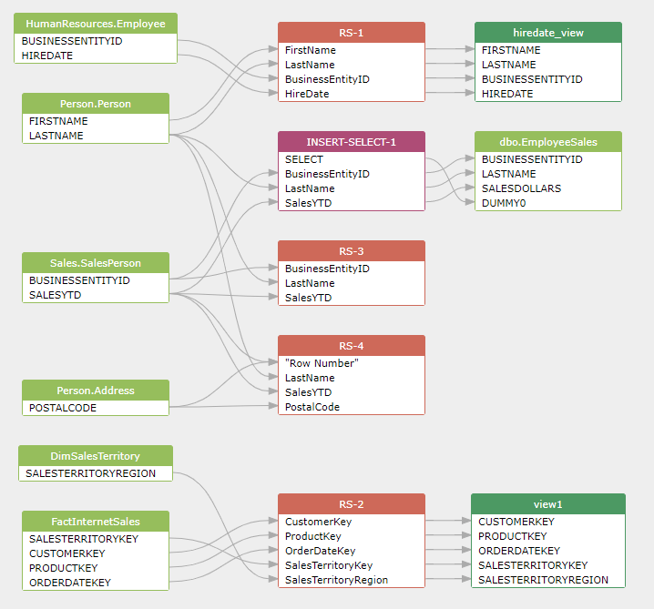

## Python Data lineage: using the SQLFlow REST API (Advanced)

This article illustrates how to discover the data lineage using Python and the SQLFlow REST API.

By using the SQLFlow REST API, you can code in python to discover the data lineage in SQL scripts
and get the result in an actionable diagram, json, csv or graphml format.

You can integerate the python code provided here into your own project and add the powerful 
data lineage analsysis capability instantly.

### 1. interactive data lineage visualizations


### 2. [Data lineage in JSON format](python-data-lineage-result.json)

### 3. Data lineage in CSV, graphml format


## Prerequisites
- [SQLFlow Cloud Server or on-premise version](https://github.com/sqlparser/sqlflow_public/tree/master/api#prerequisites)
- Python 2.7 or higher version must be installed and configured correctly.
- Installing Dependency Libraries: 
```
pip install requests
```

### Usage
````
python Grabit.py /s server /p port /u userId /k userSecret /t databaseType /f path_to_config_file /r resultType 

eg: 
    python Grabit.py /u 'auth0|xxx' /k cab9712c45189014a94a8b7aceeef7a3db504be58e18cd3686f3bbefd078ef4d /s https://api.gudusoft.com /t oracle /f demo.sql /r 1
	
note:
    If the parameter string contains symbols like "|" , it must be included in a single quotes (' ')
````

Example:

1. Connect to the SQLFlow Cloud Server
```
python Grabit.py /s https://api.gudusoft.com /u 'YOUR_USER_ID' /k YOUR_SECRET_KEY /t sqlserver /f python-data-lineage-sqlserver.sql /r 1 
```

2. Connect to the SQLFlow on-premise
This will discover data lineage by analyzing the `python-data-lineage-sqlserver.sql` file. You may also specify a zip file which includes lots of SQL files.
```
python Grabit.py /s http://127.0.0.1 /p 8081 /u 'gudu|0123456789' /t sqlserver /f python-data-lineage-sqlserver.sql /r 1 
```

This will discover data lineage by analyzing all SQL files under `sqlfiles` directory. 
```
python Grabit.py /s http://127.0.0.1 /p 8081 /u 'gudu|0123456789' /t mysql /f sqlfiles /r 1 
```


### Parameters

- **path_to_config_file**

This can be a single SQL file, a zip file including multiple SQL files, or a directory including lots of SQL files.

- **server**

Usually, it is the IP address of [the SQLFlow on-premise version](https://www.gudusoft.com/sqlflow-on-premise-version/) 
installed on your owner servers such as `127.0.0.1` or `http://127.0.0.1`

You may set the value to `https://api.gudusoft.com` if you like to send your SQL script to [the SQLFlow Cloud Server](https://sqlflow.gudusoft.com) to get the data lineage result.

- **port**

The default value is `8081` if you connect to your SQLFlow on-premise server.

However, if you setup the nginx reverse proxy in the nginx configuration file like this:
```
    location /api/ {
        proxy_pass http://127.0.0.1:8081/;
        proxy_connect_timeout 600s ;
        proxy_read_timeout 600s;
        proxy_send_timeout 600s;
        
        proxy_set_header Host $host;
        proxy_set_header X-Real-IP $remote_addr;
        proxy_set_header X-Forwarded-For $proxy_add_x_forwarded_for;
        proxy_set_header User-Agent $http_user_agent;  
    }
```
Then, keep the value of `serverPort` empty and set `server` to the value like this: `http://127.0.0.1/api`.

>Please keep this value empty if you connect to the SQLFlow Cloud Server by specifying the `https://api.gudusoft.com` 
in the `server`
                                                                                                                                                                                                                                                                                                                                                                                                                                                                                                                                                                                                                                                                                                                           >
- **userId, userSecret**

This is the user id that is used to connect to the SQLFlow server.
Always set this value to `gudu|0123456789` and keep `userSecret` empty if you use the SQLFlow on-premise version.

If you want to connect to [the SQLFlow Cloud Server](https://sqlflow.gudusoft.com), you may [request a 30 days premium account](https://www.gudusoft.com/request-a-premium-account/) to 
[get the necessary userId and secret code](/sqlflow-userid-secret.md).


- **databaseType**

This parameter specifies the database dialect of the SQL scripts that the SQLFlow has analyzed.

```txt
	access,bigquery,couchbase,dax,db2,greenplum,hana,hive,impala,informix,mdx,mssql,
	sqlserver,mysql,netezza,odbc,openedge,oracle,postgresql,postgres,redshift,snowflake,
	sybase,teradata,soql,vertica
```

- **resultType**

When you submit SQL script to the SQLFlow server, A job is created on the SQLFlow server
and you can always see the graphic data lineage result via the browser, 


Even better, This demo will fetch the data lineage back to the directory where the demo is running.
Those data lineage results are stored in the `data/datalineage/` directory. 

This parameter specifies which kind of format is used to save the data lineage result.

Available values for this parameter:
- 1: JSON, data lineage result in JSON.
- 2: CSV, data lineage result in CSV format.
- 3: diagram, in graphml format that can be viewed by yEd.

### SQLFlow REST API
Please check here for the detailed information about the [SQLFlow REST API](https://github.com/sqlparser/sqlflow_public/tree/master/api/sqlflow_api.md)
