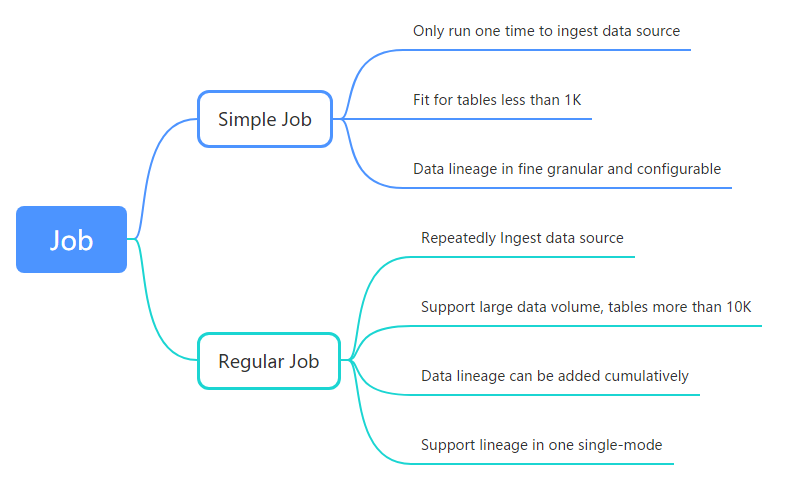

- [SQLFlow Job API tutorial](#sqlflow-job-api-tutorial)
  * [1. Prerequisites](#1-prerequisites)
    + [Difference of the API calls between SQLFlow Cloud server and SQLFlow on-premise version](#difference-of-the-api-calls-between-sqlflow-cloud-server-and-sqlflow-on-premise-version)
    + [Generate a token](#generate-a-token)
  * [2. Different type of Job](#2-different-type-of-job)
  * [3. Simple job rest API](#3-simple-job-rest-api)
    + [1. Submit a sqlflow job](#1-submit-a-sqlflow-job)
    + [2. Get job status](#2-get-job-status)
    + [3. Export data lineage](#3-export-data-lineage)
  * [4. Regular job rest API](#4-regular-job-rest-api)


## SQLFlow Job API tutorial

This article describes how to use the Job Rest API provided by the SQLFlow to 
communicate with the SQLFlow server and export the data lineage in json, csv, graphml formats.

### 1. Prerequisites
In order to use the SQLFlow rest API, you may connect to the [**SQLFlow Cloud server**](https://sqlflow.gudusoft.com),
Or, setup a [**SQLFlow on-premise version**](https://www.gudusoft.com/sqlflow-on-premise-version/) on your owner server.


1. **SQLFlow Cloud server**

- User ID
- Secrete Key

If you want to connect to [the SQLFlow Cloud Server](https://sqlflow.gudusoft.com), you may [request a 30 days premium account](https://www.gudusoft.com/request-a-premium-account/) to 
[get the necessary userId and secret code](/sqlflow-userid-secret.md).


2. **SQLFlow on-premise version**

Please [check here](https://github.com/sqlparser/sqlflow_public/blob/master/install_sqlflow.md) to see how to install SQLFlow on-premise version on you own server.

- User ID
- Secrete Key

Always set userId to `gudu|0123456789` and keep `userSecret` empty when connect to the SQLFlow on-premise version.


#### Difference of the API calls between SQLFlow Cloud server and SQLFlow on-premise version

1. TOKEN is not needed in the API calls when connect to the SQLFlow on-premise version
2. userId alwyas set to `gudu|0123456789` and `userSecret` leave empty when connect to the SQLFlow on-premise version.
3. The server port is 8081 by default for the SQLFlow on-premise version, and There is no need to specify the port when connect to the SQLFlow Cloud server.

Regarding the server port of the SQLFlow on-premise version, please [check here](https://github.com/sqlparser/sqlflow_public/tree/master/grabit#1-sqlflow-server) for more information.

#### Generate a token

Once you have the `userid` and `secret key`, the first API need to call is:

```
/gspLive_backend/user/generateToken
```

This API will return a temporary token that needs to be used in the API call thereafter.

```
curl -X POST "https://api.gudusoft.com/gspLive_backend/user/generateToken" -H  "Request-Origion:testClientDemo" -H  "accept:application/json;charset=utf-8" -H  "Content-Type:application/x-www-form-urlencoded;charset=UTF-8" -d "secretKey=YOUR SECRET KEY" -d "userId=YOUR USER ID HERE"
```

More detail, please see https://github.com/sqlparser/sqlflow_public/edit/master/api/readme.md

### 2. Different type of Job


### 3. Simple job rest API

#### 1. Submit a sqlflow job

Call this API by sending the SQL files and get the result includes the data lineage. SQLFlow job supports both of multiple files and zip archive file.

```
/gspLive_backend/sqlflow/job/submitUserJob
```

Example in `Curl`
```
curl -X POST "https://api.gudusoft.com/gspLive_backend/sqlflow/job/submitUserJob" -H "accept:application/json;charset=utf-8" -H "Content-Type:multipart/form-data" -F "userId=YOUR USER ID HERE" -F "token=YOUR TOKEN HERE" -F "sqlfiles=@FIRST FILE PATH" -F "sqlfiles=@SECOND FILE PATH" -F "dbvendor=dbvmssql" -F "jobName=job1"
```

**Note:**
 * **-H "Content-Type:multipart/form-data"** is required
 * Add **@** before the file path
 
Return data: 
```json
{
	"code":200,
	"data":{
		"jobId":"c359aef4bd9641d697732422debd8055",
		"jobName":"job1",
		"userId":"google-oauth2|104002923119102769706",
		"dbVendor":"dbvmssql",
		"dataSource":{
			
		},
		"fileNames":["1.sql","1.zip"],
		"createTime":"2020-12-15 15:14:39",
		"status":"create"
	}
}
```

Please records the jobId field.

#### 2. Get job status

 * Get the specify user job status and summary
  
  ```
  /gspLive_backend/sqlflow/job/displayUserJobSummary
  ```
  
  Example in `Curl`
  
  ```json
  curl -X POST "https://api.gudusoft.com/gspLive_backend/sqlflow/job/displayUserJobSummary" -F "jobId=c359aef4bd9641d697732422debd8055" -F "userId=YOUR USER ID HERE" -F "token=YOUR TOKEN HERE"
  ```
  
  Return data:
  ```json
  {
	"code":200,
	"data":{
		"jobId":"c359aef4bd9641d697732422debd8055",
		"jobName":"job1",
		"userId":"google-oauth2|104002923119102769706",
		"dbVendor":"dbvmssql",
		"dataSource":{
			
		},
		"fileNames":["1.sql","1.zip"],
		"createTime":"2020-12-15 15:14:39",
		"status":"success",
		"sessionId":"fe5898d4e1b1a7782352b50a8203ca24c04f5513446e9fb059fc4d584fab4dbf_1608045280033"
	}
  }
  ```
  
 * Get all jobs (include history jobs) status and summary
 
  ```
  /gspLive_backend/sqlflow/job/displayUserJobsSummary
  ```
 
  Example in `Curl`
  
  ```json
  curl -X POST "https://api.gudusoft.com/gspLive_backend/sqlflow/job/displayUserJobsSummary" -F "userId=YOUR USER ID HERE" -F "token=YOUR TOKEN HERE"
  ```
  
 

#### 3. Export data lineage
 
 When the job status is **success**, you can export the data lineage in json, csv, graphml formats

 * 3.1 Export data lineage in json format
  
  ```
  /gspLive_backend/sqlflow/job/exportLineageAsJson
  ```
  
  Example in `Curl`  
  
  ```
  curl -X POST "https://api.gudusoft.com/gspLive_backend/sqlflow/job/exportLineageAsJson" -F "userId=YOUR USER ID HERE" -F "token=YOUR TOKEN HERE" -F "jobId=c359aef4bd9641d697732422debd8055" --output lineage.json
  ```
  **Note:**
   > If you want to get table to table relation, please add option -F "tableToTable=true"
 
 * 3.2 Export data lineage in csv format
  
  ```
  /gspLive_backend/sqlflow/job/exportFullLineageAsCsv
  ```
  
  Example in `Curl`  
  
  ```
  curl -X POST "https://api.gudusoft.com/gspLive_backend/sqlflow/job/exportLineageAsCsv" -F "userId=YOUR USER ID HERE" -F "token=YOUR TOKEN HERE" -F "jobId=c359aef4bd9641d697732422debd8055" --output lineage.csv
  ```
  
  **Note:**
   > If you want to get table to table relation, please add option -F "tableToTable=true"
   > If you want to change csv delimiter, please add option -F "delimiter=<delimiter char>" 
  
 
 * 3.3 Export data lineage in graphml format, you can view the lineage graph at yEd Graph Editor
   
  ```
  /gspLive_backend/sqlflow/job/exportLineageAsGraphml
  ``` 
  
  Example in `Curl`  
  
  ```
  curl -X POST "https://api.gudusoft.com/gspLive_backend/sqlflow/job/exportLineageAsGraphml" -F "userId=YOUR USER ID HERE" -F "token=YOUR TOKEN HERE" -F "jobId=c359aef4bd9641d697732422debd8055" --output lineage.graphml
  ```
  
  **Note:**
   > If you want to get table to table relation, please add option -F "tableToTable=true"
   
### 4. Regular job rest API   
