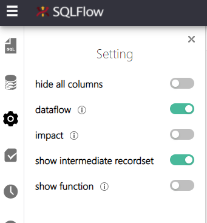
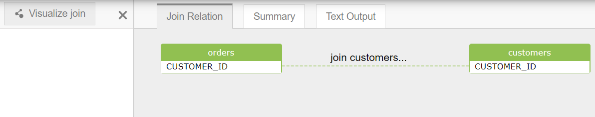
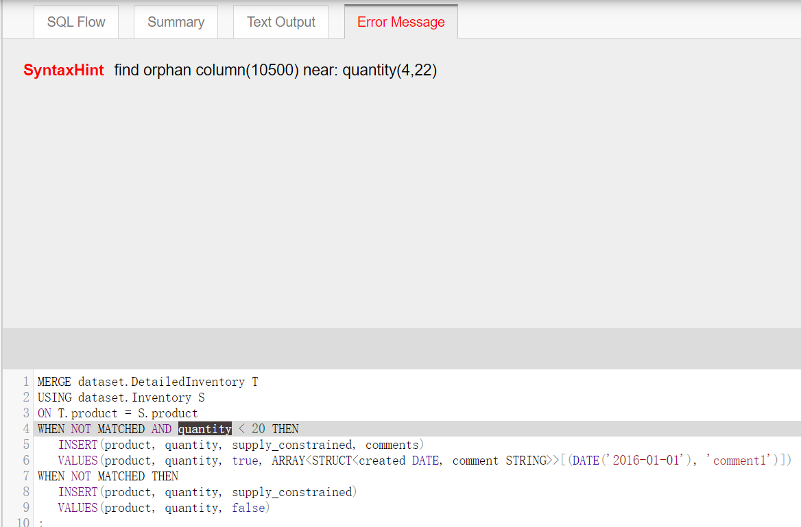

# SQLFlow Web UI Control



SQLFlow Web UI has some choice to control the result:

1. hide all columns
   * just affect ui, table column ui height is 0.
2. dataflow
   * show fdd relation.
3. impact
   * show fdr, fdr relations.
4. show intermediate recordset
   * display or hide intermediate recordset
5. show function
   * display or hide function

We use the restful api **/sqlflow/generation/sqlflow/graph** to get the sqlflow graph, it has several arguments:
   * **userId**: the user id of sqlflow web or client, required **true** 
   * **token**: the token of sqlflow client request. sqlflow web, required false, sqlflow client, required true
   * sqltext: sql text, required false
   * sqlfile: sql file, required false
   * **dbvendor**: database vendor, required **true**, available values: 
      * dbvbigquery, dbvcouchbase,dbvdb2,dbvgreenplum,dbvhana,dbvhive,dbvimpala,dbvinformix,dbvmdx,dbvmysql,dbvnetezza,dbvopenedge,dbvoracle,dbvpostgresql,dbvredshift,dbvsnowflake,dbvmssql,dbvsybase,dbvteradata,dbvvertica
   * showRelationType: show relation type, required false, default value is **fdd**, multiple values seperated by comma like fdd,frd,fdr. Available values:
     * **fdd**: value of target column from source column
     * **frd**: the recordset count of target column which is affect by value of source column
     * **fdr**: value of target column which is affected by the recordset count of source column
     * **join**: combine rows from two or more tables, based on a related column between them
   * simpleOutput: whether output relation simply, required false, default value is false
   * ignoreRecordSet: whether ignore the record sets, required false, default value is false  
   * showLinkOnly: whether show relation linked columns only, required false, default value is true 
   * hideColumn: whether hide the column ui, required false, default value is false 
   * ignoreFunction: whether ignore the function relations, required false, default value is false 

## How to Control The Sqlflow Web UI
  
1. hide all columns
   * it matches the `hideColumn` argument. If the argument is `true`, `hideColumn` will be checked.
2. dataflow
   * it matches the `showRelationType` argument. If the argument contains `fdd`, `dataflow` will be checked.
3. impact
   * it matches the `showRelationType` argument. If the argument contains `fdr,fdd`, `impact` will be checked.   
4. show intermediate recordset
   * it matches the `ignoreRecordSet` argument. If the argument is `true`, `show intermediate recordset` will be checked.   
5. show function
   * it matches the `ignoreFunction` argument. If the argument is `true`, `show function` will be checked.
   
   

1. Visualize join
   * show join relations.
   * it matches the `showRelationType` argument. If the argument is `join`,  `Visualize join` will be displayed.

  

If sqlflow has some errors, it will be shown in the sqlflow json.
Sqlflow error message has 4 types:
 * SYNTAX_ERROR
    * gsp parsing sql returns some error messages. 
 * SYNTAX_HINT
    * gsp parsing sql returns some hint messages.
 * ANALYZE_ERROR
    * dataflow analyzer occurs error.
 * LINK_ORPHAN_COLUMN   
    * dataflow analyzer returns linking orphan column hint.

## How to Get The Error Message Position    
Typically, if the datafow returns error messages, the lineage xml will show:
```xml
<dlineage>
   ...
   <error errorMessage="find orphan column(10500) near: quantity(4,22)" errorType="SyntaxHint" coordinate="[4,22,0],[4,30,0]" originCoordinate="[4,22],[4,30]"/>
</dlineage>
```  
Noting `coordinate="[4,22,0],[4,30,0]"`, we can use it to get the error position. [4,22,0] is the start position and [4,30,0] is the end position, 0 is the index of SQLInfo hashcode. 

## Get SQL Information By SQLFLow Coordinate

### SQLInfo
When the sqlflow analyzing sql has been finished, it recorded some sql information, we can use it to locate database object position.

```java
public class SqlInfo {
    private String fileName;
    private String sql;
    private int originIndex;
    private int index;
    private String group;
    private int originLineStart;
    private int originLineEnd;
    private int lineStart;
    private int lineEnd;
    private String hash;
}
```

Each sql file matches a SqlInfo object, and the map key is "hash" property.

Sqlflow provides a tool class **gudusoft.gsqlparser.dlineage.util.SqlInfoHelper**, which can transform dataflow coordinate to `DbObjectPosition`.

### SqlInfoHelper

1. First step, call api `SqlInfoHelper.getSqlInfoJson` to fetch the sqlinfo map from the DataFlowAnalyzer object, and persist it.
```java
    public static String getSqlInfoJson(DataFlowAnalyzer analyzer);
```

2. Second step, initialize the SqlInfoHelper with the sqlinfo json string.
```java
    //Constructor
    public SqlInfoHelper(String sqlInfoJson);
```

3. Third step, transform sqlflow position string to `dataflow.model.json.Coordinate` array.
  * If you use the `dataflow.model.json.DataFlow` model, you can get the Coordinate object directly, doesn't need any transform.
  * If you use the `dataflow.model.xml.dataflow` model, you can call api `SqlInfoHelper.parseCoordinateString`
  ```java
    public static Coordinate[][] parseCoordinateString(String coordinate);
  ```
  * Method parseCoordinateString support both of xml output coordinate string and json output coordinate string, like these:
  ```
      //xml output coordinate string
      [56,36,64e5c5241fd1311e41b2182e40f77f1e],[56,62,64e5c5241fd1311e41b2182e40f77f1e]

      //json output coordinate string
      [{"x":31,"y":36,"hashCode":"64e5c5241fd1311e41b2182e40f77f1e"},{"x":31,"y":38,"hashCode":"64e5c5241fd1311e41b2182e40f77f1e"}]     
  ``` 

4. Fourth step, get the DbObjectPosition by api `getSelectedDbObjectInfo`
```java
    public DbObjectPosition getSelectedDbObjectInfo(Coordinate start, Coordinate end);
```
  * Each position has two coordinates, start coordinate and end coordinate. If the result of DBObject.getCoordinates() has 10 items, it matches 5 positions. 
  * The position is based on the entire file, but not one statement.
  * The sql field of DbObjectPosition return all sqls of the file.

5. If you just want to get the specific statement information, please call the api `getSelectedDbObjectStatementInfo`
```java
    public DbObjectPosition getSelectedDbObjectStatementInfo(EDbVendor vendor, Coordinate start, Coordinate end);
```
  * The position is based on the statement.
  * Return the statement index of sqls, index **bases 0**.
  * Return a statement, but not all sqls of the file. 
  
### How to use DbObjectPosition
```java
public class DbObjectPosition {
    private String file;
    private String sql;
    private int index;
    private List<Pair<Integer, Integer>> positions = new ArrayList<Pair<Integer, Integer>>();
}
```
* file field matches the sql file name.
* sql field matches the sql content.
* index: 
   * If the sql file is from `grabit`, it's a json file, and it has an json array named "query", the value of index field is the query item index.  
   * Other case, the value of index field is 0.
* positions, locations of database object, they are matched the sql field. Position x and y **base 1** but not 0.    

### Example 1 (getSelectedDbObjectInfo)
```java
  String sql = "Select\n a\nfrom\n b;";
  DataFlowAnalyzer dataflow = new DataFlowAnalyzer(sql, EDbVendor.dbvmssql, false);
  dataflow.generateDataFlow(new StringBuffer());
  dataflow flow = dataflow.getDataFlow();
  String coordinate = flow.getTables().get(0).getCoordinate();
  Coordinate[][] coordinates = SqlInfoHelper.parseCoordinateString(coordinate);
  SqlInfoHelper helper = new SqlInfoHelper(SqlInfoHelper.getSqlInfoJson(dataflow));
  DbObjectPosition position = helper.getSelectedDbObjectInfo(coordinates[0][0], coordinates[0][1]);
  System.out.println(position.getSql());
  System.out.println("table " + flow.getTables().get(0).getName() + " position is " + Arrays.toString(position.getPositions().toArray()));
``` 

Return:
```java
Select
 a
from
 b;

table b position is [[4,2], [4,3]]
```

### Example 2 (getSelectedDbObjectStatementInfo)
```java
  String sql = "Select\n a\nfrom\n b;\n     Select c from d;";
  DataFlowAnalyzer dataflow = new DataFlowAnalyzer(sql, EDbVendor.dbvmssql, false);
  dataflow.generateDataFlow(new StringBuffer());
  gudusoft.gsqlparser.dlineage.dataflow.model.xml.dataflow flow = dataflow.getDataFlow();
  String coordinate = flow.getTables().get(1).getCoordinate();
  Coordinate[][] coordinates = SqlInfoHelper.parseCoordinateString(coordinate);
  SqlInfoHelper helper = new SqlInfoHelper(SqlInfoHelper.getSqlInfoJson(dataflow));
  DbObjectPosition position = helper.getSelectedDbObjectStatementInfo(EDbVendor.dbvmssql, coordinates[0][0], coordinates[0][1]);
  System.out.println(position.getSql());
  System.out.println(
          "table " + flow.getTables().get(1).getName() + " position is " + Arrays.toString(position.getPositions().toArray()));
  System.out.println(
          "stmt index is " + position.getIndex());
``` 

Return:
```java
Select c from d;
table d position is [[1,20], [1,21]]
stmt index is 1
```


 
 


      
   
   