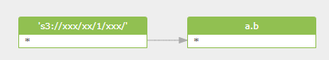

### Discover data lineage from Hive alter table set location

```sql
ALTER TABLE a.b SET LOCATION 's3://xxx/xx/1/xxx/';
```
#### output lineage in diagram


#### output lineage in xml
```xml
<?xml version="1.0" encoding="UTF-8" standalone="yes"?>
<dlineage>
    <path id="8" name="'s3://xxx/xx/1/xxx/'" uri="'s3://xxx/xx/1/xxx/'" type="path" coordinate="[1,30,0],[1,50,0]">
        <column id="9" name="*" coordinate="[-1,-1,0],[-1,-1,0]"/>
    </path>
    <process id="6" name="Query Set Table Location-1" procedureName="batchQueries" queryHashId="05e88d7c9059de6a9fcbf0b185930152" type="sstaltertable" coordinate="[1,1,0],[1,51,0]"/>
    <table id="4" database="a" name="a.b" type="table" processIds="6" coordinate="[1,13,0],[1,16,0]">
        <column id="5" name="*" coordinate="[1,1,0],[1,2,0]"/>
    </table>
    <relationship id="1" type="fdd" processId="6" processType="sstaltertable">
        <target id="5" column="*" parent_id="4" parent_name="a.b" coordinate="[1,1,0],[1,2,0]"/>
        <source id="9" column="*" parent_id="8" parent_name="'s3://xxx/xx/1/xxx/'" coordinate="[-1,-1,0],[-1,-1,0]"/>
    </relationship>
</dlineage>
```

This data lineage in xml is generated by [Gudu SQLFlow Java tool](https://www.gudusoft.com/sqlflow-java-library-2/)


