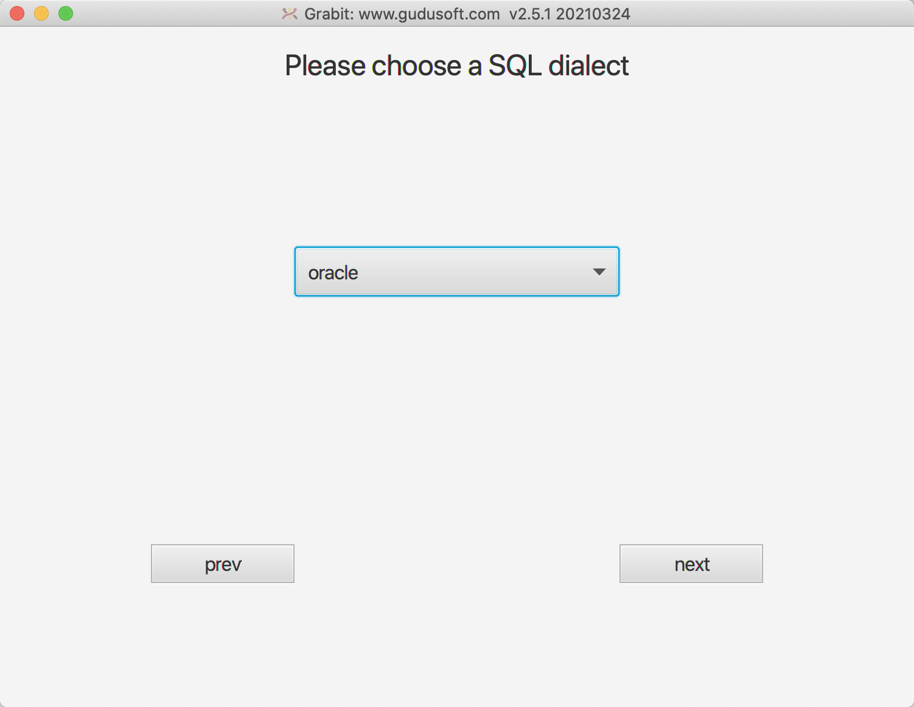
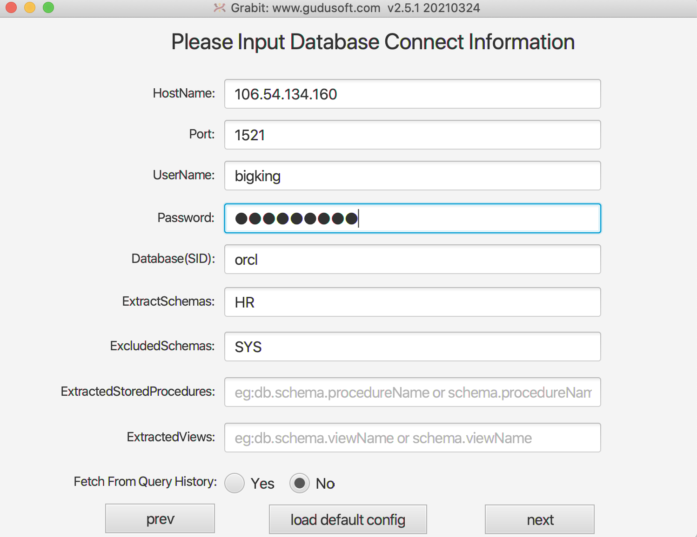
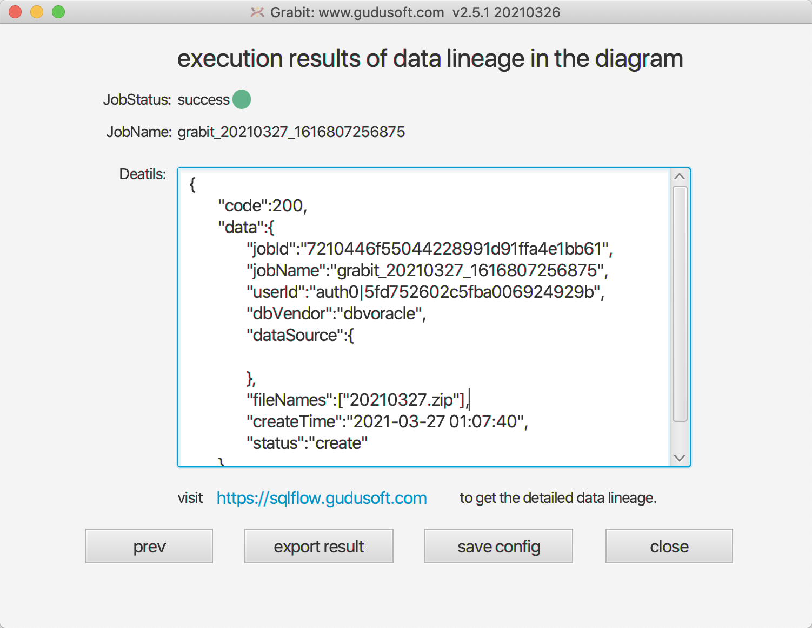
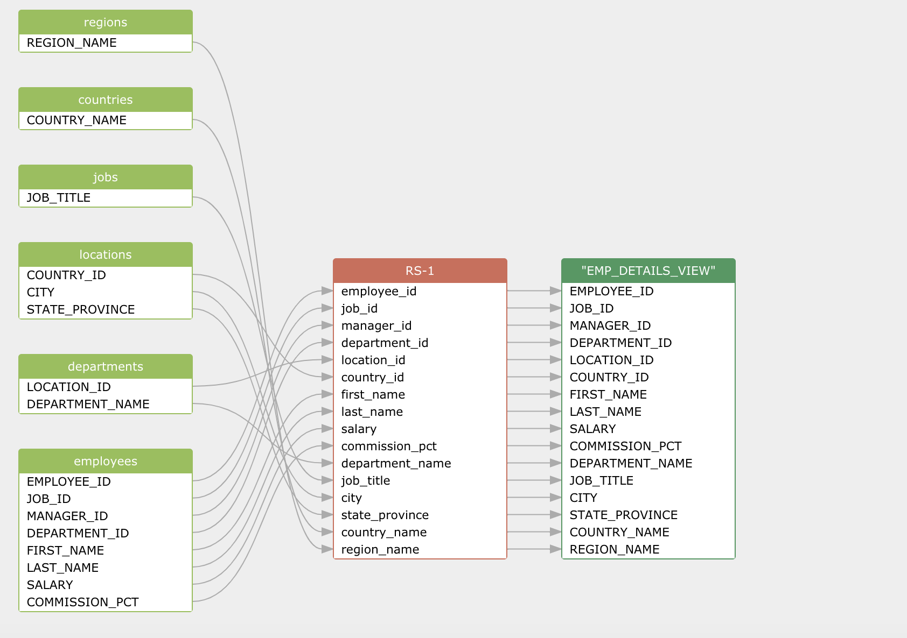

## Automated data lineage from Oracle (GUI Mode)
This article introduces how to discover the data lineage from Oracle scripts or the Oracle database and automatically update it. 
So the business users and developers can see the Oracle data lineage graph instantly.

### Software used in this solution
- [SQLFlow Cloud](https://sqlflow.gudusoft.com) Or [SQLFlow on-premise version](https://www.gudusoft.com/sqlflow-on-premise-version/)
- [Grabit tool](https://www.gudusoft.com/grabit/) for SQLFlow. It's free.

### Install grabit tool
After [download grabit tool](https://www.gudusoft.com/grabit/), please [check this article](https://github.com/sqlparser/sqlflow_public/tree/master/grabit) 
to see how to setup the grabit tool.

### Discover data lineage in a SQL Server database
- After [start up the grabit tool](https://github.com/sqlparser/sqlflow_public/tree/master/grabit#running-the-grabit-tool), this is the first UI.
Click the `database` button.

-  Select `oracle` in the list

- Set the database parameters. In this example, we only discover the data lineage in HR schema, and SYS schema the excluded.

- After grabbing the metadata from the Oracle database, connect to the SQLFlow server. 
It would help if you had [a premium account](https://github.com/sqlparser/sqlflow_public/blob/master/sqlflow-userid-secret.md) to access the SQLFlow Cloud.

- Submit the database metadata to the SQLFlow server and get the data lineage 

- Check out the diagram via this url: [https://sqlflow.gudusoft.com/#/job/latest](https://sqlflow.gudusoft.com/#/job/latest)

- You may save the data lineage in JSON/CSV/GRAPHML format

The file will be saved under `data\datalineage` directory.

### Further information
This tutorial illustrates how to discover the data lineage of a Oracle database in the grabit UI mode,
If you like to automated the data lineage discovery, you may use the Grabit command line mode.

- [Discover Oracle data lineage in command line mode](grabit-oracle-command-line.md)

This tutorial illustrates how to discover the data lineage of a Oracle database by submitting the database
metadata to the SQLFlow Cloud version, You may set up the [SQLFlow on-premise version](https://www.gudusoft.com/sqlflow-on-premise-version/)
on your server to secure your information.

For more options of the grabit tool, please check this page.
- [Grabit tool readme](https://github.com/sqlparser/sqlflow_public/tree/master/grabit)

The completed guide of SQLFlow UI
- [How to use SQLFlow](https://github.com/sqlparser/sqlflow_public/blob/master/sqlflow_guide.md)

### Know-How

