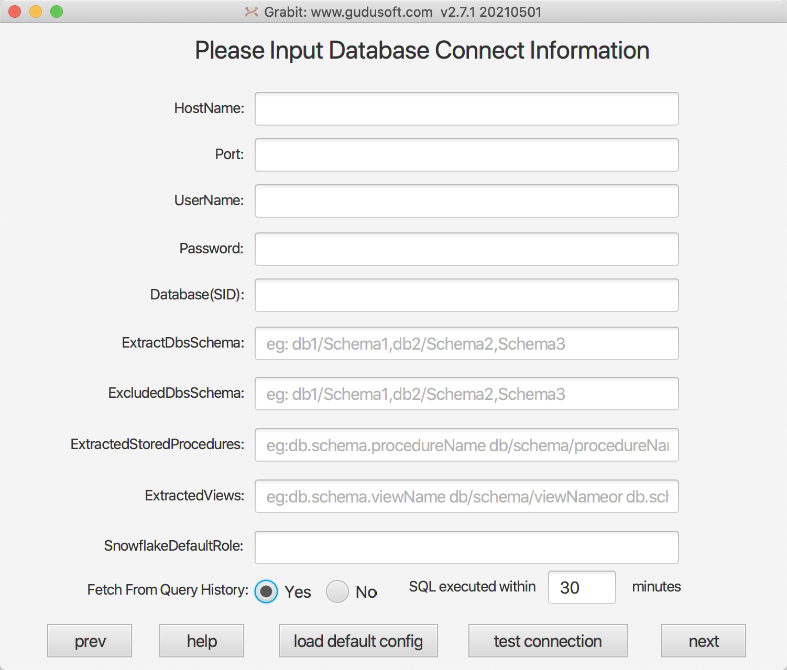

## Grabit Databse Connection Information Document

Specify a database instance that grabit will connect to fetch the metadata that helps SQLFlow make a more precise analysis and get a more accurate result of data lineage.

#### Databse Connection Information UI


#### Parameter Specification Of Connection Information

- **hostname**

The IP of the database server that the grabit connects.

- **port**

The port number of the database server that the grabit connect.

- **username**

The database user used to login to the database.

- **password**

The password of the database user.

- **database**

Name of the Oracle instance. 

For other databases, it represents the database name and is optional.
If it's specified, only metadata under this database will be extracted.

`
note: This parameter is required when the database to which you are connecting is azure,greenplum,netezza,oracle,postgresql,redshift,teradata.
`

- **extractedDbsSchemas**

List of databases and schemas to extract, separated by
commas, which are to be provided in the format database/schema;
Or blank to extract all databases.
`database1/schema1,database2/schema2,database3` or `database1.schema1,database2.schema2,database3`
When parameter `database` is filled in, this parameter is considered a schema.
And support wildcard characters such as `database1/*`,`*/schema`,`*/*`.

When the connected databases are `Oracle` and `Teradata`, this parameter is set the schemas, for example:

````json
extractedDbsSchemas: "HR,SH"
````

When the connected databases are `Mysql` , `Sqlserver`, `Postgresql`, `Snowflake`, `Greenplum`, `Redshift`, `Netezza`, `Azure`, this parameter is set database/schema, for example:

````json
extractedDbsSchemas: "MY/ADMIN"
````


- **excludedDbsSchemas**

This parameters works under the resultset filtered by `extractedDbsSchemas`.
List of databases and schemas to exclude from extraction, separated by commas
`database1/schema1,database2` or `database1.schema1,database2` 
When parameter `database` is filled in, this parameter is considered a schema.
And support wildcard characters such as `database1/*`,`*/schema`,`*/*`.

When the connected databases are `Oracle` and `Teradata`, this parameter is set the schemas, for example:

````json
excludedDbsSchemas: "HR"
````

When the connected databases are `Mysql` , `Sqlserver`, `Postgresql`, `Snowflake`, `Greenplum`, `Redshift`, `Netezza`, `Azure`, this parameter is set database/schema, for example:

````json
excludedDbsSchemas: "MY/*"
````

- **extractedStoredProcedures**

A list of stored procedures under the specified database and schema to extract, separated by
commas, which are to be provided in the format database.schema.procedureName or schema.procedureName;
Or blank to extract all databases, support expression.
`database1.schema1.procedureName1,database2.schema2.procedureName2,database3.schema3,database4` or `database1/schema1/procedureName1,database2/schema2`

for example:

````json
extractedStoredProcedures: "database.scott.vEmp*"
````

or

````json
extractedStoredProcedures: "database.scott"
````

- **extractedViews**

A list of stored views under the specified database and schema to extract, separated by
commas, which are to be provided in the format database.schema.viewName or schema.viewName.
Or blank to extract all databases, support expression.
`database1.schema1.procedureName1,database2.schema2.procedureName2,database3.schema3,database4` or `database1/schema1/procedureName1,database2/schema2`

for example:

````json
extractedViews: "database.scott.vEmp*"
````

or

````json
extractedViews: "database.scott"
````

- **fetch from query history**

Fetch SQL queries from the query history if set to `yes` default is no, SQL statement that can retrieve history execution from the database to which it is connected. You can specify the time for history execution. The default is 30 minutes.

`
note: Currently only supported Snowflake,Sqlserver
`
