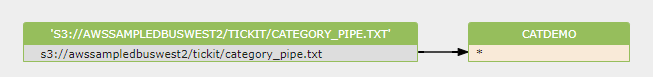
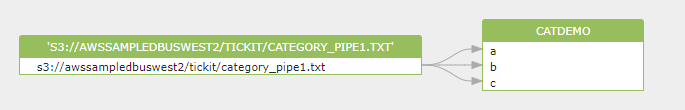

# AWS redshift database column-level data lineage

Discover and visualization lineage from AWS redshift database and SQL script.

### Copy command

```sql
copy catdemo
from 's3://awssampledbuswest2/tickit/category_pipe.txt'
iam_role 'arn:aws:iam::<aws-account-id>:role/<role-name>'
region 'us-west-2';
```

data lineage diagram:

[](https://sqlflow.gudusoft.com)


```sql
copy catdemo(a,b,c)
from 's3://awssampledbuswest2/tickit/category_pipe.txt'
iam_role 'arn:aws:iam::<aws-account-id>:role/<role-name>'
region 'us-west-2';

```

data lineage diagram:

[](https://sqlflow.gudusoft.com)


