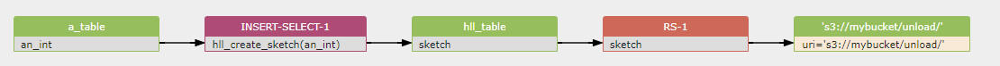

# AWS redshift database SQL column-level data lineage

Discover and visualization lineage from AWS redshift database and SQL script.

### 1. Copy command

```sql
copy catdemo
from 's3://awssampledbuswest2/tickit/category_pipe.txt'
iam_role 'arn:aws:iam::<aws-account-id>:role/<role-name>'
region 'us-west-2';
```

data lineage diagram:

[](https://sqlflow.gudusoft.com)


```sql
copy catdemo(a,b,c)
from 's3://awssampledbuswest2/tickit/category_pipe.txt'
iam_role 'arn:aws:iam::<aws-account-id>:role/<role-name>'
region 'us-west-2';

```

data lineage diagram:

[](https://sqlflow.gudusoft.com)


### 2. Unload command
```sql
CREATE TABLE a_table(an_int INT, b_int INT);
INSERT INTO a_table VALUES (1,1), (2,1), (3,1), (4,1), (1,2), (2,2), (3,2), (4,2), (5,2), (6,2);

CREATE TABLE hll_table (sketch HLLSKETCH);
INSERT INTO hll_table select hll_create_sketch(an_int) from a_table group by b_int;

UNLOAD ('select * from hll_table') TO 's3://mybucket/unload/'
IAM_ROLE 'arn:aws:iam::0123456789012:role/MyRedshiftRole' NULL AS 'null' ALLOWOVERWRITE CSV;
```

[](https://sqlflow.gudusoft.com)