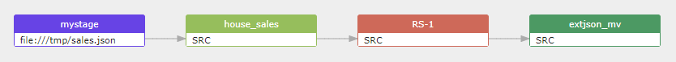

## Snowflake data lineage captured from the script used in bulk Loading from JSON file using COPY

```sql
create or replace file format json_format
  type = 'JSON'
  strip_outer_array = true;

/* Create an internal stage that references the JSON file format. */

create or replace stage mystage
  file_format = json_format;

/* Stage the JSON file. */

put file:///tmp/sales.json @mystage auto_compress=true;

/* Create a target table for the JSON data. */

create or replace table house_sales (src variant);

/* Copy the JSON data into the target table. */

copy into house_sales
   from @mystage/sales.json.gz;


create materialized view extjson_mv
  as
  select * from house_sales;  
  
```

## Data lineage build for the above SQL script 
mystage(file:///tmp/sales.json, JSON) -> fdd -> house_sales(src) -> fdd -> extjson_mv

[](https://sqlflow.gudusoft.com)