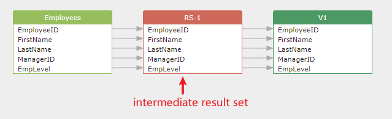
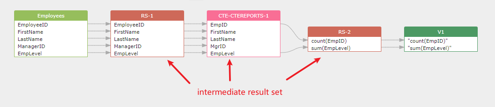
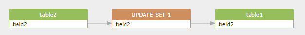

## Temporary result set

[toc]

A temporary result set is the table-like output produced inside a query (for example, a SELECT list, CTE, subquery, PIVOT/UNPIVOT, or clauses in MERGE/UPDATE). It exists only during query execution and helps explain how data flows step by step.

How it maps to SQLFlow lineage:
- v1: represented as `<resultset>` elements with specific `type` values (e.g., `select_list`, `with_cte`, `pivot_table`).
- v2: represented as `lineageObjects` (type `table`) with `properties.isTemporary=true` and a deterministic `qualifiedName` such as `...resultset.{processId}#{sqlHash}#{queryId}` for merge-safe uniqueness.

You can choose to hide temporary result sets in the UI to simplify large graphs while keeping complete lineage available when needed.

### 1. What is a temporary result set?

In the SQLFlow, a temporary result set is the table-like output of a SELECT statement or clause.

The temporary result set is used to show the details of the data flow and let you know exactly what is going on. 

The temporary result set is always built in order to create a complete data flow graph. However, you may choose to hide the temporary result set in the UI in order to make the data flow graph cleaner in a big data flow scenario.

For example:

```sql
CREATE VIEW v1 AS
SELECT EmployeeID, FirstName, LastName, ManagerID, EmpLevel  -- resultset1
FROM Employees
WHERE ManagerID IS NULL
```

The temporary result set is:

```
EmployeeID, FirstName, LastName, ManagerID, EmpLevel
```
in the select list and shown in the data flow graph as below:



### CTE example:

CTE is treated as a temporary result set.
<a name="cte-example">
```sql
CREATE VIEW V1 AS
WITH
  cteReports (EmpID, FirstName, LastName, MgrID, EmpLevel)
  AS
  (
    SELECT EmployeeID, FirstName, LastName, ManagerID, EmpLevel  -- resultset1
    FROM Employees
    WHERE ManagerID IS NULL
  )
SELECT
  count(EmpID), sum(EmpLevel)  -- resultset2
FROM cteReports 
```
</a>
So, there are three temporary result sets:

1. resultset1: EmployeeID, FirstName, LastName, ManagerID, EmpLevel
2. cte: cteReports (EmpID, FirstName, LastName, MgrID, EmpLevel) 
3. resultset2: count(EmpID), sum(EmpLevel)

And the data flow graph is like this:



### 2. SQL clauses that generate temporary result sets

The definition of temporary result set types can be found in the [ResultSetType.java](src/main/java/gudusoft/gsqlparser/dlineage/dataflow/model/ResultSetType.java)

```java
array, struct, result_of, cte, insert_select, update_select, merge_update, 
merge_insert, output, update_set,pivot_table, unpivot_table, alias, rs, function, 
case_when;
```

#### 1. select list (select_list)
```sql
SELECT EmployeeID, FirstName, LastName, ManagerID, EmpLevel  FROM Employees
```

the temporary result set generated: (a `resultset` XML tag and type attribute value `select_list`)

```xml
<resultset id="11" name="RS-1" type="select_list">
    <column id="12" name="EmployeeID"/>
    <column id="13" name="FirstName"/>
    <column id="14" name="LastName"/>
    <column id="15" name="ManagerID"/>
    <column id="16" name="EmpLevel"/>
</resultset>
```


#### 2. cte (cte)
[CTE example SQL](#cte-example), the temporary result set generated: (a `resultset` XML tag and type attribute value `with_cte`)
```xml
<resultset id="4" name="CTE-CTEREPORTS-1" type="with_cte">
    <column id="5" name="EmpID"/>
    <column id="6" name="FirstName"/>
    <column id="7" name="LastName"/>
    <column id="8" name="MgrID"/>
    <column id="9" name="EmpLevel"/>
    <column id="3" name="RelationRows" source="system"/>
</resultset>
```

#### 3. set clause in update statement (update_set)
```sql
UPDATE table1 t1 JOIN table2 t2 ON t1.field1 = t2.field1 
SET t1.field2=t2.field2 --mysql
```

the temporary result set generated: (a `resultset` XML tag and type attribute value `update-set`)

```xml
<resultset id="11" name="UPDATE-SET-1" type="update-set">
    <column id="12" name="field2"/>
    <column id="10" name="RelationRows" source="system"/>
</resultset>
```



#### 4. merge statement (update_select, merge_update)

```sql
-- bigquery sample SQL
MERGE dataset.DetailedInventory T USING dataset.Inventory S ON T.product = S.product
WHEN NOT MATCHED AND s.quantity < 20 THEN
  INSERT(product, quantity, supply_constrained, comments)
  VALUES(product, quantity, true, ARRAY<STRUCT<created DATE, comment STRING>>[(DATE('2016-01-01'), 'comment1')])
WHEN NOT MATCHED THEN
  INSERT(product, quantity, supply_constrained)
  VALUES(product, quantity, false)
;
```

the temporary result set generated: (a `resultset` XML tag with type attribute value `merge-insert`)

```xml
<resultset id="11" name="MERGE-INSERT-1" type="merge-insert">
    <column id="12" name="product"/>
    <column id="15" name="quantity"/>
    <column id="18" name="supply_constrained"/>
    <column id="20" name="comments"/>
</resultset>
<resultset id="23" name="MERGE-INSERT-2" type="merge-insert">
    <column id="24" name="product"/>
    <column id="25" name="quantity"/>
    <column id="26" name="supply_constrained"/>
</resultset>
```
#### 5. pivot table (pivot_table)

```sql
-- sql server sample SQL
SELECT *
FROM
(
    SELECT salesperson, product, sales_amount
    FROM sales
) AS SourceTable
PIVOT
(
    SUM(sales_amount)
    FOR product IN ([Laptop], [Desktop], [Tablet])
) AS PivotTable;
```

the temporary result set generated: (a `resultset` XML tag and type attribute value `pivot_table`)

```xml
<resultset id="19" name="PIVOT-TABLE-1" type="pivot_table">
    <column id="20" name="[Laptop]"/>
    <column id="21" name="[Desktop]"/>
    <column id="22" name="[Tablet]"/>
</resultset>
```

#### 6. unpivot table (unpivot_table)

```sql
-- sql server sample SQL
SELECT ProductID, Quarter, Sales
FROM SalesData
UNPIVOT
(
    Sales
    FOR Quarter IN (Q1_Sales, Q2_Sales, Q3_Sales, Q4_Sales)
) AS UnpivotedData;
```

the temporary result set generated: (a `resultset` XML tag and type attribute value `unpivot_table`)

```xml
<resultset id="4" name="UNPIVOT-TABLE-1" type="unpivot_table">
    <column id="5" name="Sales"/>
    <column id="6" name="Quarter"/>
</resultset>
```

#### 7. table alias (alias)

The table alias: p (empid_renamed, Q1, Q2, Q3, Q4) in the following SQL statement:
```sql
-- sql server sample SQL
SELECT *
FROM quarterly_sales
         PIVOT(SUM(amount) FOR quarter IN ('2023_Q1','2023_Q2','2023_Q3','2023_Q4')
        ) AS p (empid_renamed, Q1, Q2, Q3, Q4)
ORDER BY empid_renamed;
```

the temporary result set generated: (a `resultset` XML tag and type attribute value `alias`)

```xml
<resultset id="13" name="ALIAS-1" type="alias">
    <column id="14" name="Q1"/>
    <column id="15" name="Q2"/>
    <column id="16" name="Q3"/>
    <column id="17" name="Q4"/>
    <column id="36" name="empid_renamed"/>
</resultset>
```

#### 8. array, struct, result_of, output, rs
Those temporary result set types are not used in the SQLFlow.


### 3. List of all temporary result sets

A complete list of all temporary result sets that can be controlled to remove from the data flow graph is as follows:


1. XML tag: `<resultset>`, type attribute value:`select_list`
2. XML tag: `<resultset>`, type attribute value:`with_cte`
3. XML tag: `<resultset>`, type attribute value:`update-set`
4. XML tag: `<resultset>`, type attribute value:`merge-insert`
5. XML tag: `<resultset>`, type attribute value:`pivot_table`
6. XML tag: `<resultset>`, type attribute value:`unpivot_table`
7. XML tag: `<resultset>`, type attribute value:`alias`
8. XML tag: `<resultset>`, type attribute value:`function`
9. XML tag: `<table>`, type attribute value:`constantTable`
10. XML tag: `<variable>`, type attribute value:`variable`

所有默认生成的 `<resultset>` and `<variable>` 的内容都可以通过设置参数来移除，
所有默认没有生成的例如 `<table>` with type attribute value `constantTable` 可以通过设置参数来生成。


在 dlineage demo tool 中加入可以控制以上所有参数的设置。形如：/removeResultSetXXX, /includeTableConstantTable, /removeVariable 等。

目前在 dlineage demo tool 中的 /s , /i, /if 等参数都是这些参数的一种组合。


## Temporary table

This section is about how to handle the temporary table in the data lineage analysis.

Some user like to see the temporary table in the data lineage analysis, but some user don't like to see the temporary table in the data lineage analysis.

thus we provide an option `/withTemporaryTable` to let user decide whether to output the temporary table in the data lineage analysis.

Temporary table such as `#temp_table` in SQL Server will not be output in simple output by default.

If you want to output the temporary table, you can use `/withTemporaryTable` option.

```
/withTemporaryTable
```

### Temporary table in different database

Different database products have different syntax for temporary table.

For example:

- In SQL Server, the temporary table is like `#temp_table`.
- In MySQL, The temporary table is like `tmp_table`.