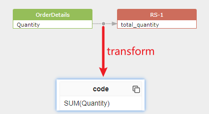

## Transforms

[toc]

### 1. What is transform?

In the SQLFlow, transform is the code snippet that transform the data from source to target.
```sql
SELECT SUM(Quantity) as total_quantity FROM OrderDetails;
```

The code snippet `SUM(Quantity)` is a transform that transform the data from the source `OrderDetails.Quantity` to the target `total_quantity`.




Transform can be as simple as a function or as complex as a sub-query and stored procedure, it shows the data transformation relationship between the source and target, and tells you how the data is transformed.

### 2. How transform is organized in the data lineage model?

In the data lineage model, a transform is the sub-node of a relationship node.
More than one transform can be generated for a relationship node.
```xml
<relationship id="2" type="fdd" effectType="function">
    <target id="11" column="SUM" parent_id="10" parent_name="SUM"/>
    <source id="5" column="Quantity" parent_id="4" parent_name="OrderDetails">
    <transforms>
        <transform type="function">
            <code>SUM(Quantity)</code>
        </transform>
    </transforms>
    </source>
</relationship>
```


