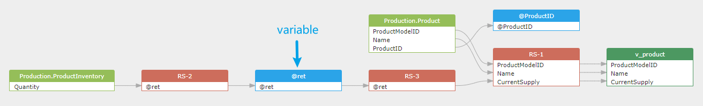

## 1 Constant

Constants used in the SQL statement will be collected and saved in a pseudo table: `constantTable`.
Each SQL statement will create a `constantTable` table to save the constants used in the SQL statement.

So SQLFlow able to generate the data flow to trace the constant value.
> Constants only will be collected when the /showConstant is set to true in the SQLFlow.
and constants used in the insert statement WILL NOT BE collected in order to avoid too many constants even if the /showConstant is set to true.

>By default, the /showConstant is set to false in the SQLFlow which means constants will not be collected.

```sql
SELECT 'constant' as field1, 2 as field2;
```

a `table` XML tag and type attribute value `constantTable`:

```xml
  <table id="5" name="SQL_CONSTANTS-1" type="constantTable">
      <column id="6" name="'constant'"/>
      <column id="8" name="2"/>
  </table>
```

```sql
UPDATE table1 t1 JOIN table2 t2 ON t1.field1 = t2.field1 
SET t1.field2='constant' and t1.field3=2;
```

a `table` XML tag and type attribute value `constantTable`:

```xml
  <table id="15" name="SQL_CONSTANTS-1" type="constantTable">
      <column id="16" name="'constant'"/>
      <column id="17" name="2"/>
  </table>
```

## 2 Variables

SQLFlow able to generate the data flow to trace the variable value which usually used in the stored procedure and return value.
Without the trace of the variable, the data flow is not complete.

```sql
-- sql server sample query
CREATE FUNCTION dbo.ufnGetInventoryStock(@ProductID int)
RETURNS int
AS
-- Returns the stock level for the product.
BEGIN
    DECLARE @ret int;
    SELECT @ret = SUM(p.Quantity)
    FROM Production.ProductInventory p
    WHERE p.ProductID = @ProductID
        AND p.LocationID = '6';
     IF (@ret IS NULL)
        SET @ret = 0;
    RETURN @ret;
END;

create view v_product as
SELECT ProductModelID, Name, dbo.ufnGetInventoryStock(ProductID)AS CurrentSupply
FROM Production.Product
WHERE ProductModelID BETWEEN 75 and 80;
```

As you can see, with the trace of the variable, the data flow from `Production.ProductInventory.Quantity` to the `v_product.CurrentSupply` is complete.



The data lineage in xml format is as follows:

```xml
<variable id="19" name="@ret" type="variable" subType="record" parent="dbo.ufnGetInventoryStock">
    <column id="20" name="@ret"/>
</variable>
```

