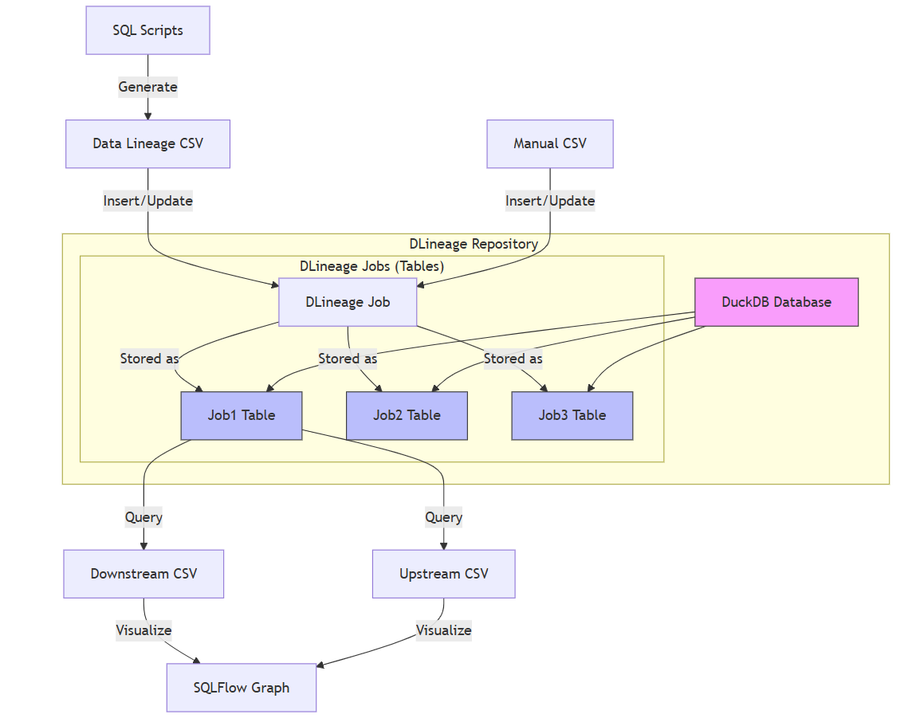

Generate data lineage in csv format (in simple mode only) and then insert/update the data lineage into duckdb.
Able to query the downstream/upstream data lineage of a column in duckdb, and output the result in csv format.
Visualize the data lineage graph in this csv file using SQLFlow widget.

## 1. The format of the csv file
```
hashcode, source_db, source_schema, source_table, source_column, target_db, target_schema, target_table, target_column, first_insert_time, last_update_time,count
```

The source_db, source_schema, target_db and target_schema maybe empty, however, it's strongly recommended to fill them with the actual values.

The hashcode is the hash value (md5) of the source_db, source_schema, source_table, source_column, target_db, target_schema, target_table, target_column.

## 2. How it works
1. Dlineage read the sql script, generate the data lineage in csv format. (only simple mode)
2. Insert/update the data lineage into duckdb.
    - Calculate the hashcode of the data lineage.
    - If the data lineage does not exist, insert the data lineage into duckdb, set the first_insert_time, last_update_time to the current time, set the count to 1.
    - If the data lineage already exists, update the last_update_time to the current time, and increase the count by 1.
3. Query the downstream/upstream data lineage of a column in a job saved in duckdb, and output the result in csv format.
4. Visualize the data lineage graph in this csv file using SQLFlow widget.



This diagram shows:
1. SQL scripts or manual CSV files are the input sources
2. Data lineage is extracted and formatted as CSV
3. The data is stored in DLineage Jobs, which are implemented as tables in DuckDB
4. All jobs are contained within the DLineage Repository (a directory containing the DuckDB database)
5. Users can query the jobs to generate downstream/upstream CSV files
6. These CSV files can be visualized using SQLFlow
Each job (table) in DuckDB contains columns for:
- hashcode
- source_db, source_schema, source_table, source_column
- target_db, target_schema, target_table, target_column
- first_insert_time, last_update_time
- count


## 3. Dlineage implementation
### 3.1. Initialize the data lineage repository
In order to insert/update the data lineage into duckdb, we need to initialize the data lineage repository first.

```
/init_dlineage_repo
```
This will create a directory named `dlineage_repo` in the current directory, and create a duckdb database named `dlineage` in this directory.
If a directory named `dlineage_repo` already exists, this command will do nothing and tell the user that the data lineage repository already exists.

All the other job/duckdb related commands will use this directory as the data lineage repository. and must check if the data lineage repository exists before running the commands.

```
/delete_dlineage_repo
```
This will delete the directory named `dlineage_repo` and all the files in this directory.
This is a dangerous command, use it with caution and prompt the user to confirm the operation.

### 3.2. Insert/update the data lineage into duckdb

**A dlineage job** is a logical concept, which is used to group the data lineage of some sql scripts.
User may collect the sql scripts from time to time, and generate the data lineage of these sql scripts,
and insert/update the data lineage into duckdb. So, the data lineage collected in different time periods are stored in a same job which can 
be queried later for analysis.

Each table in the duckdb repository is used to store the data lineage of a dlineage job.

Many dlineage jobs can be stored in the duckdb repository, and each dlineage job is stored in a separate table in the duckdb repository.

```
/create_dlineage_job <job_name>
```
This will create a table named `<job_name>` in the duckdb repository, and the table is used to store the data lineage of the dlineage job `<job_name>`.

The `<job_name>` must be a valid duckdb identifier.

If the table named `<job_name>` already exists, this command will do nothing and tell the user that the table already exists.

```
/delete_dlineage_job <job_name>
```
This will delete the table named `<job_name>` in the duckdb repository.
This is a dangerous command, use it with caution and prompt the user to confirm the operation.

```
/list_dlineage_jobs
```
This will list all the dlineage jobs in the duckdb repository. It will print the job name and the creation time of each job.

```
/show_dlineage_job_info <job_name>
```
This will show the information of the dlineage job `<job_name>`. It will print the job name, the creation time, the last update time, and the number of data lineage records in the job.


```
/collect_dlineage <job_name> <sql_script_file>
```
This will collect the data lineage of the sql script file `<sql_script_file>`, and insert/update the data lineage into the dlineage job `<job_name>`.
The `<job_name>` must already exists, otherwise, this command will do nothing and tell the user that the dlineage job does not exist.

Print out the total number of data lineage records collected, how many records are inserted, how many records are updated, how much time it takes.

The `<sql_script_file>` can be a single sql script file, or a directory containing multiple sql script files, or a zip file containing multiple sql script files.

We can also collect the data lineage from a csv file which contains the data lineage we manually collected using other tools.

```
/collect_dlineage_from_csv <job_name> <csv_file>
```
This will collect the data lineage from the csv file `<csv_file>`, and insert/update the data lineage into the dlineage job `<job_name>`.

The `<csv_file>` must be in the format like this:
```
source_db, source_schema, source_table, source_column, target_db, target_schema, target_table, target_column
```

### 3.3. Query the data lineage from duckdb

```
/query_dlineage_downstream <job_name> <source_db> <source_schema> <source_table> <source_column>
```
This will query the downstream data lineage of the column `[source_db.][source_schema.]<source_table>.<source_column>` in the dlineage job `<job_name>`.
The output is a csv file, each line of which is a downstream data lineage of the column `[source_db.][source_schema.]<source_table>.<source_column>`.

source_db and target_db can be omitted, if omitted, it means source_table.source_column has only one determined source_db.source_schema.
Otherwise, source_db and source_schema must be specified. If there are multiple source_db.source_schema for the source_table.source_column, it will report an error.

The output csv will be in the format like this:
```
source_db, source_schema, source_table, source_column, target_db, target_schema, target_table, target_column
```


```
/query_dlineage_upstream <job_name> <target_db> <target_schema> <target_table> <target_column>
```
This will query the upstream data lineage of the column `[target_db.][target_schema.]<target_table>.<target_column>` in the dlineage job `<job_name>`.
The output is a csv file, each line of which is a upstream data lineage of the column `[target_db.][target_schema.]<target_table>.<target_column>`.

The output csv will be in the format like this:
```
source_db, source_schema, source_table, source_column, target_db, target_schema, target_table, target_column
```


### 3.4. Visualize the data lineage graph
Once we have the data lineage csv file, we can use SQLFlow to visualize the data lineage graph.
```
/visualize_dlineage <dlineage_csv_file>
```
This will open a web page in the default browser, displaying the data lineage graph of the dlineage csv file `<dlineage_csv_file>`.

the data lineage csv file can be a downstream data lineage csv file or an upstream data lineage csv file generated by the commands `/query_dlineage_downstream` or `/query_dlineage_upstream`. or any other csv file in the same format.

## 4. Summary of the commands
```
/init_dlineage_repo
/delete_dlineage_repo
/create_dlineage_job <job_name>
/delete_dlineage_job <job_name>
/list_dlineage_jobs
/show_dlineage_job_info <job_name>
/collect_dlineage <job_name> <sql_script_file>
/collect_dlineage_from_csv <job_name> <csv_file>
/query_dlineage_downstream <job_name> <source_db> <source_schema> <source_table> <source_column>
/query_dlineage_upstream <job_name> <target_db> <target_schema> <target_table> <target_column>
/visualize_dlineage <dlineage_csv_file>
```
