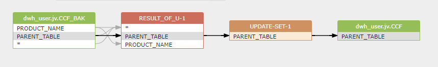

# Discover data lineage from sub-query and CTE

SQL is very flexible, and it's possible to write a SQL statement in many different ways to achieve the same result.

The following SQL statement is used to update the PARENT_TABLE column of the CCF table based on the PARENT_TABLE column of the CCF_BAK table.
and it is written in 3 different ways.

The first way is to use the UPDATE statement with a sub-query.
The second way is to use the UPDATE statement with 2 sub-queries.
The third way is to use the CTE (Common Table Expression) with the same result.

SQLFlow can discover the data lineage from all the 3 SQL statements.
[](https://sqlflow.gudusoft.com)

```sql
-- sql server
UPDATE s
SET s.PARENT_TABLE = u.PARENT_TABLE
FROM dwh_user.jv.CCF s
JOIN (
    SELECT TOP 1 *
    FROM dwh_user.jv.CCF_BAK u
    WHERE u.PRODUCT_NAME = 'Business loan'
) u ON 1 = 1
WHERE s.PRODUCT_NAME = 'Business loan'
```

Data lineage of the first SQL statement in xml format generated by [SQLFlow](https://sqlflow.gudusoft.com/):
```xml
<relationship id="10" type="fdd" effectType="update" processId="5" processType="sstupdate">
    <target id="19" column="PARENT_TABLE" parent_id="4" parent_name="dwh_user.jv.CCF" parent_alias="s"/>
    <source id="13" column="PARENT_TABLE" parent_id="11" parent_name="dwh_user.jv.CCF_BAK" parent_alias="u"/>
</relationship>
```

```sql
-- sql server
UPDATE s
SET s.PARENT_TABLE = u.PARENT_TABLE
FROM (
    SELECT *
    FROM dwh_user.jv.CCF s
    WHERE s.PRODUCT_NAME = 'Business loan'
) s
JOIN (
    SELECT TOP 1 *
    FROM dwh_user.jv.CCF_BAK u
    WHERE u.PRODUCT_NAME = 'Business loan'
) u ON 1 = 1
```

Data lineage of the second SQL statement in xml format generated by [SQLFlow](https://sqlflow.gudusoft.com/):   
```xml
<relationship id="12" type="fdd" effectType="update" processId="5" processType="sstupdate">
    <target id="24" column="PARENT_TABLE" parent_id="4" parent_name="dwh_user.jv.CCF" parent_alias="s"/>
    <source id="18" column="PARENT_TABLE" parent_id="16" parent_name="dwh_user.jv.CCF_BAK" parent_alias="u"/>
</relationship>
```

```sql
-- sql server
WITH
    s AS (
        SELECT PARENT_TABLE
        FROM dwh_user.jv.CCF s
        WHERE s.PRODUCT_NAME = 'Business loan'
    ),
    u AS (
        SELECT TOP 1 PARENT_TABLE
        FROM dwh_user.jv.CCF_BAK u
        WHERE u.PRODUCT_NAME = 'Business loan'
    )
UPDATE s
SET s.PARENT_TABLE = u.PARENT_TABLE
FROM s
JOIN u ON 1 = 1
```

Data lineage of the third SQL statement in xml format generated by [SQLFlow](https://sqlflow.gudusoft.com/):
```xml
<relationship id="19" type="fdd" effectType="update" processId="5" processType="sstupdate">
    <target id="10" column="PARENT_TABLE" parent_id="4" parent_name="dwh_user.jv.CCF" parent_alias="s"/>
    <source id="24" column="PARENT_TABLE" parent_id="23" parent_name="dwh_user.jv.CCF_BAK" parent_alias="u"/>
</relationship>
```
