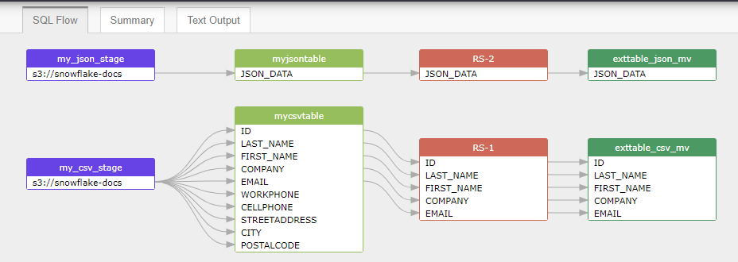

## Automated data lineage from SQL scripts in Github/bitbucket

Grabit able to fetch SQL scripts from the GitHub/bitbucket repo,
and automated data lineage from those SQL scripts by sending it
to the SQLFlow server.

In this article, we will show you how to fetch snowflake SQL scripts
in [a github repo](https://github.com/sqlparser/snowflake-data-lineage) and
sent it to the SQLFlow for analyzing to get the data lineage visually.

### Software used in this solution
- [SQLFlow on-premise version](https://www.gudusoft.com/sqlflow-on-premise-version/)
- [Grabit tool](https://www.gudusoft.com/grabit/) for SQLFlow. It's free.

You may [request a 30 days SQLFlow on-premise version](https://www.gudusoft.com/submit-a-ticket/)
by filling out a form with the subject: request a 30 days SQLFlow on-premise version.

Our team will contact you in 1-3 working days after receiving the message.


### Prerequisites
- A Linux/mac/windows server with at least 8GB memory (ubuntu 20.04 is recommended).
- Java 8
- Nginx web server. 
- Port needs to be opened. (80, 8761,8081,8083. Only 80 port need to be opened if you set up the Nginx reverse proxy as mentioned in [this document](https://github.com/sqlparser/sqlflow_public/blob/master/install_sqlflow.md))

### Install SQLFlow on-premise version
- [Guilde for install on linux](https://github.com/sqlparser/sqlflow_public/blob/master/install_sqlflow.md)
- [Guilde for install on window](https://github.com/sqlparser/sqlflow_public/blob/master/install_sqlflow_on_windows.md)
- [Guilde for install on mac](https://github.com/sqlparser/sqlflow_public/blob/master/install_sqlflow_on_mac.md)

### Install grabit tool
After [download grabit tool](https://www.gudusoft.com/grabit/), please [check this article](https://github.com/sqlparser/sqlflow_public/tree/master/grabit) 
to see how to setup the grabit tool.


### Install git
- **ubuntu:** 
```
sudo apt-get install git
```
- **centos:** 
```
sudo yum install git
```
- **mac:** 
```
brew install git
```
- **windows:** 
```
1.Go to the Git official website to download, website address: https://git-scm.com/downloads
2.Run the Git installation file and click Next to finish the installation
```
After the installation is completed, run **git --version** to check it is installed successfully.

- **Generate the ssh public and private key**：
```
ssh-keygen -o
```


### Set up grabit configuration file

`optionType=2` tells the grabit tool the SQL scripts are located in a github repo.

```
{
	"optionType":2,
	"resultType":1,
	"databaseType":"snowflake",
	"SQLFlowServer":{
		"server":"http://111.229.12.71",
		"serverPort":"8081",
		"userId":"gudu|0123456789",
		"userSecret":"" 
	},	
	"githubRepo":{
	    "url":"https://github.com/sqlparser/snowflake-data-lineage",
	    "username":"",
	    "password":"",
	    "sshkeyPath":""
	}
}
```

For other detailed information, please [check here](https://github.com/sqlparser/sqlflow_public/tree/master/grabit#6-githubrepo--bitbucketrepo)

Now, you can get the full data lineage like this:



### Know-How


