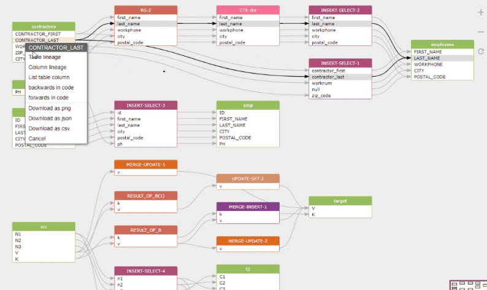
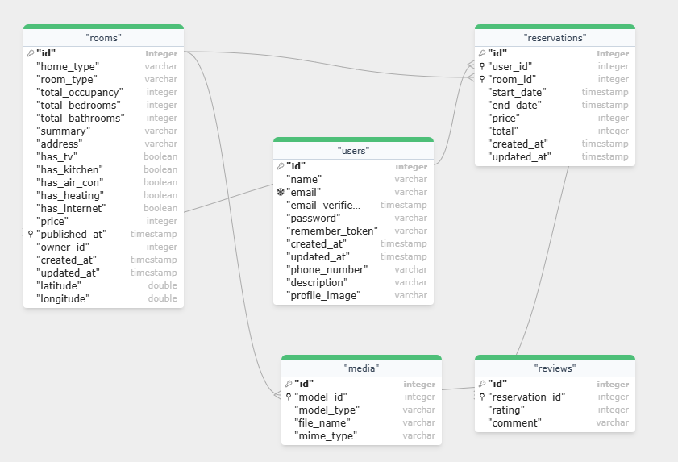

# Gudu SQL Omni

**Comprehensive SQL analysis for Visual Studio Code**

Transform your SQL development with powerful, offline syntax validation for over 20 database dialects, interactive data lineage visualization, smart schema extraction, and instant ER diagram generation—all powered by [Gudu SQLFlow](https://sqlflow.gudusoft.com) technology.

## 🚀 Why Gudu SQL Omni?

- **20+ Database Support**: Oracle, MySQL, PostgreSQL, SQL Server, BigQuery, Snowflake, and more
- **Syntax Validation**: Validate any complex SQL without database connection, with precise error locations
- **Visual Data Lineage**: See how data flows through your queries with interactive diagrams
- **Smart Schema Analysis**: Automatically extract tables, columns, and relationships
- **CodeLens Integration**: View SQL metadata inline without cluttering your code

## ✨ Key Features

### SQL Validation & Intelligence

- Instant syntax validation with line-precise error reporting
- Auto-detection of SQL dialect
- Support for complex queries, CTEs, and stored procedures
- Multi-statement SQL file support

### Data Lineage Visualization


- Interactive flow diagrams showing data movement
- Table and column-level lineage tracking
- Impact analysis for schema changes
- Export diagrams as PNG

### Schema Extraction & Analysis
- Extract tables and columns from any SQL
- Tree view in dedicated activity bar
- Support for CTEs, subqueries, and joins
- Data type detection

### ER Diagram Generation


- Automatic diagram creation from DDL
- Visual relationship mapping
- Interactive exploration
- Foreign key relationship support

## 📦 Quick Start

1. **Install**: Search for "Gudu SQL Omni" in VS Code Extensions and click Install.
2. **Open**: Open any `.sql` file or a text file with SQL code.
3. **Analyze**: Select a SQL statement, then right-click or use a command to trigger an action.

## 🚀 How to Use

Once installed, you can analyze your SQL code using the following commands:

- **Via Command Palette**: Press `Ctrl+Shift+P` (`Cmd+Shift+P` on macOS) and search for "Gudu SQL Omni".
- **Via Context Menu**: Right-click on selected SQL text to see available analysis options.

### Commands and Default Shortcuts

- **Validate SQL**: `Ctrl+Shift+V` / `Cmd+Shift+V`
- **Extract Schema**: `Ctrl+Shift+E` / `Cmd+Shift+E`
- **Data Lineage**: `Ctrl+Alt+L` / `Cmd+Alt+L`
- **ER Diagram**: `Ctrl+Alt+E` / `Cmd+Alt+E`

## 🎯 Perfect For

- **Database Developers**: Validate and optimize SQL across multiple platforms
- **Data Engineers**: Visualize data pipelines and dependencies
- **Data Analysts**: Understand complex queries and data relationships
- **DevOps Teams**: Validate database migrations and schema changes
- **SQL Learners**: Learn from instant feedback and visual representations

## 🔧 Supported Databases

<table>
<tr>
<td>✅ AWS Athena</td>
<td>✅ BigQuery</td>
<td>✅ Couchbase</td>
<td>✅ Databricks</td>
</tr>
<tr>
<td>✅ Dax</td>
<td>✅ DB2</td>
<td>✅ Gaussdb</td>
<td>✅ Greenplum</td>
</tr>
<tr>
<td>✅ Hana</td>
<td>✅ Hive</td>
<td>✅ Impala</td>
<td>✅ Informix</td>
</tr>
<tr>
<td>✅ Mdx</td>
<td>✅ MySQL</td>
<td>✅ Netezza</td>
<td>✅ odbc</td>
</tr>
<tr>
<td>✅ Openedge</td>
<td>✅ Oracle</td>
<td>✅ PostgreSQL</td>
<td>✅ Presto</td>
</tr>
<tr>
<td>✅ Redshift</td>
<td>✅ Snowflake</td>
<td>✅ SparkSQL</td>
<td>✅ SQLServer</td>
</tr>
<tr>
<td>✅ Sybase</td>
<td>✅ Teradata</td>
<td>✅ Trino</td>
<td>✅ Vertica</td>
</tr>
</table>

## ⚙️ Configuration

Customize the extension's behavior in your VS Code settings.

```json
{
  "guduSQLOmni.defaultDbVendor": "oracle",
  "guduSQLOmni.lineage.showTemporaryResult": true
}
```

## 💰 Pricing & Editions

Gudu SQL Omni offers multiple editions to fit your needs. All advanced features require a valid license.

-   **Basic Edition (Free)**: Perfect for individuals and students. Includes SQL validation and basic schema extraction.
-   **Professional Edition (Paid)**: For data professionals. Unlocks all features, including advanced data lineage, ER diagrams, and priority support.
-   **Enterprise Edition (Paid)**: For teams and companies. Includes all Professional features plus team-based license management and dedicated support. (**NOT AVAILABLE YET**)

<div align="center">
<a href="https://buy.stripe.com/6oU3cv3cV0VY3R70xv5Rm0L" title="Purchase Professional Edition">
    
</a>
</div>


## ❓ Frequently Asked Questions (FAQ)

**Q: Is this extension free?**  
A: The extension has a free Basic Edition with core features like SQL validation. Advanced features like Data Lineage and ER Diagram generation require a paid Professional or Enterprise license.

**Q: Where is my SQL code processed? Is it secure?**  
A: All SQL analysis is performed locally on your machine by the embedded Gudu SQLFlow engine. Your code is never sent to the cloud, ensuring your data remains private and secure.

**Q: What if my specific database dialect isn't listed?**  
A: Our SQL parser has broad compatibility. Try running the analysis with a similar dialect (e.g., use "PostgreSQL" for Redshift). If you encounter issues, please [report an issue](https://github.com/sqlparser/sqlflow_public/issues) and we'll investigate.

## 🌟 What Users Say

> "The data lineage visualization alone makes this extension worth it. Saved me hours understanding complex ETL queries!" - **Data Engineer**

> "Finally, a SQL validator that actually understands vendor-specific syntax. Works perfectly with our Snowflake queries." - **Database Developer**

> "The CodeLens feature is brilliant - I can see table/column counts without running the query. Game changer!" - **SQL Developer**

## TODO

- Connect to database to get metadata for more accurate parsing results.
- Generate data lineage for an entire database, including stored procedures.
- Generate ER diagrams for the whole database.
- Trace upstream and downstream data flows for specific tables and columns.
- Scan SQL files in a project to analyze data lineage.
- Store and consolidate data lineage from different stages to provide a comprehensive view.
- Integrate data lineage from various sources, including SQL scripts, ETL scripts, dbt, etc.

## 📚 Resources

- [Documentation](https://github.com/sqlparser/sqlflow_public/blob/master/gudu_sql_omni/README.md)
- [GitHub Repository](https://github.com/sqlparser/sqlflow_public/)
- [Report Issues](https://github.com/sqlparser/sqlflow_public/issues)
- [SQLFlow Technology](https://docs.gudusoft.com)

## 🏢 About Gudu Software

Gudu Software specializes in SQL parsing and analysis tools, trusted by thousands of developers worldwide. Our flagship SQLFlow technology powers data lineage solutions for Fortune 500 companies.

## 📄 License

This is a commercial software product. Your use of this extension is governed by the [Gudu Software Terms of Service](https://www.gudusoft.com/terms/).

Please review the full [LICENSE](LICENSE) file in our repository.

---

**Ready to supercharge your SQL development?** Install Gudu SQL Omni now!

If you find this extension helpful, please:
- ⭐ **Rate it** on the marketplace
- 📢 **Share it** with your team
- 💬 **Send feedback** to help us improve