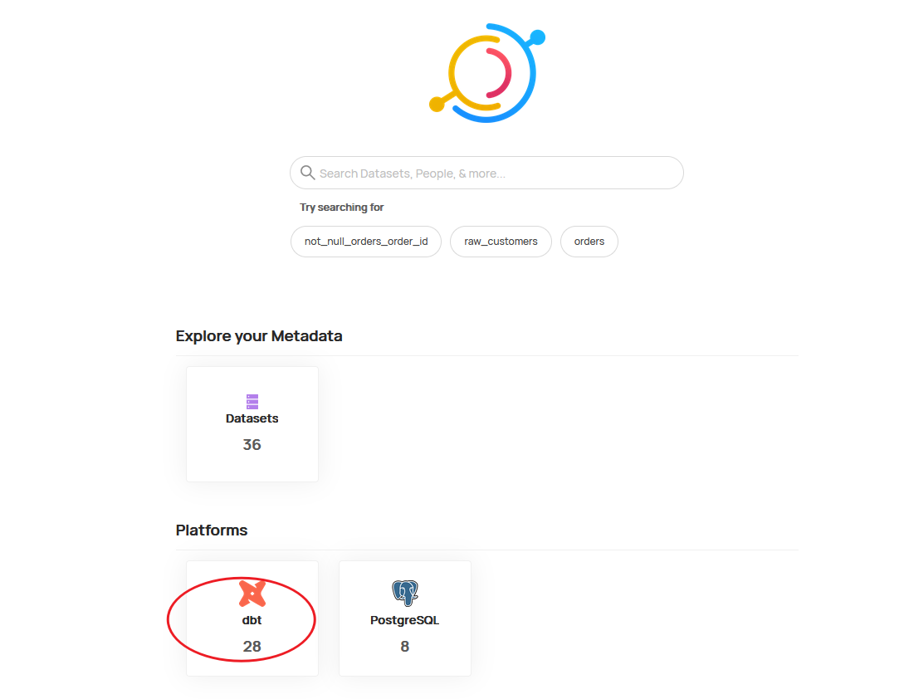
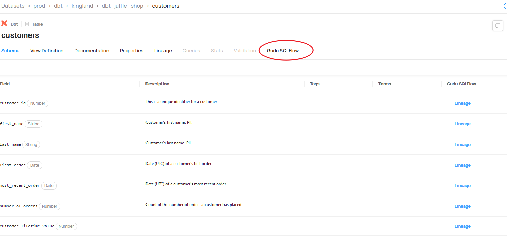
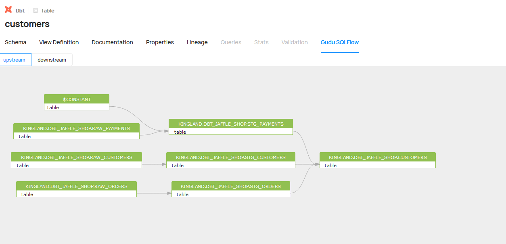
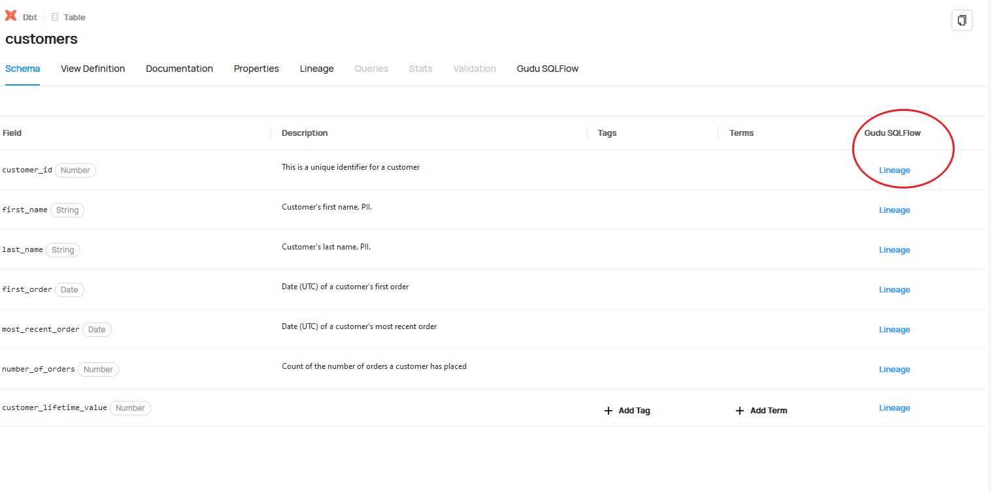
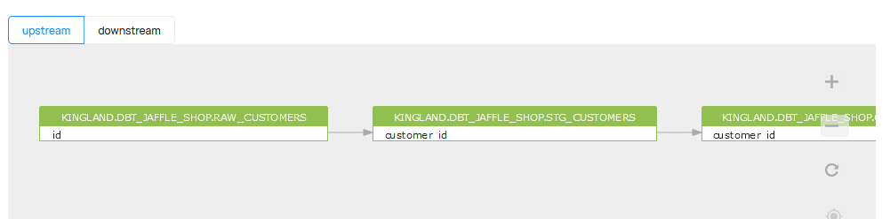

## Integrate Gudu SQLFlow into Datahub

We have built a test envionment so you can see how Gudu SQLFlow works with the Datahub.

### Demo
Please login [Datahub with Gudu SQLFlow](http://101.43.5.98:9002/) with username: datahub, password: datahub

#### 1. After login, just click the dbt icon

#### 2. Select the customer table

#### 3. You will see the Gudu SQLFlow tab

#### 4. Click the Gudu SQLFlow tab to see the upstream and downstream of this table

#### 5. Check the column level lineage by click the lineage item

#### 6. See the full column level lineage

